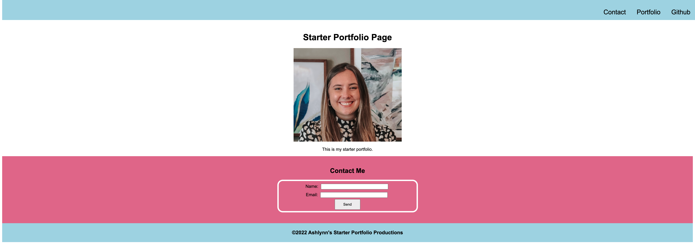

# Module 01 Mini-Project: Landing Page

## Description
This was the first mini-project assigned to me. The purpose was build a landing page using HTML and CSS.

## Table of Contents 
- [Acceptance Criteria](#acceptance-criteria)
- [Technologies Used](#technologies-used)
- [Final Application](#final-application)
- [License](#license)

## Acceptance Criteria
* Semantic HTML elements 
* Universal elements and class selectors
* Three colors in the design
* Single font and font family for all text
* At least two heading elements
* Header is fixed to the top of the page on scroll
* Navigation bar with three links that display inline
* If the contact link is clicked, the page jumps to the contact form.
* Contact form includes `input` elements for name and email.
* Contact form includes a Send button.
* Image includes a descriptive `alt` attribute.
* Page is deployed to GitHub Pages.

## Technologies Used
* 
* 

## Final Application
[View Live Link](https://ashclandry.github.io/landing-page/)

## License 
MIT License

Copyright © 2022, Ashlynn Landry

Permission is hereby granted, free of charge, to any person obtaining a copy
of this software and associated documentation files (the "Software"), to deal
in the Software without restriction, including without limitation the rights
to use, copy, modify, merge, publish, distribute, sublicense, and/or sell
copies of the Software, and to permit persons to whom the Software is
furnished to do so, subject to the following conditions:

The above copyright notice and this permission notice shall be included in all
copies or substantial portions of the Software.

THE SOFTWARE IS PROVIDED "AS IS", WITHOUT WARRANTY OF ANY KIND, EXPRESS OR
IMPLIED, INCLUDING BUT NOT LIMITED TO THE WARRANTIES OF MERCHANTABILITY,
FITNESS FOR A PARTICULAR PURPOSE AND NONINFRINGEMENT. IN NO EVENT SHALL THE
AUTHORS OR COPYRIGHT HOLDERS BE LIABLE FOR ANY CLAIM, DAMAGES OR OTHER
LIABILITY, WHETHER IN AN ACTION OF CONTRACT, TORT OR OTHERWISE, ARISING FROM,
OUT OF OR IN CONNECTION WITH THE SOFTWARE OR THE USE OR OTHER DEALINGS IN THE
SOFTWARE.

